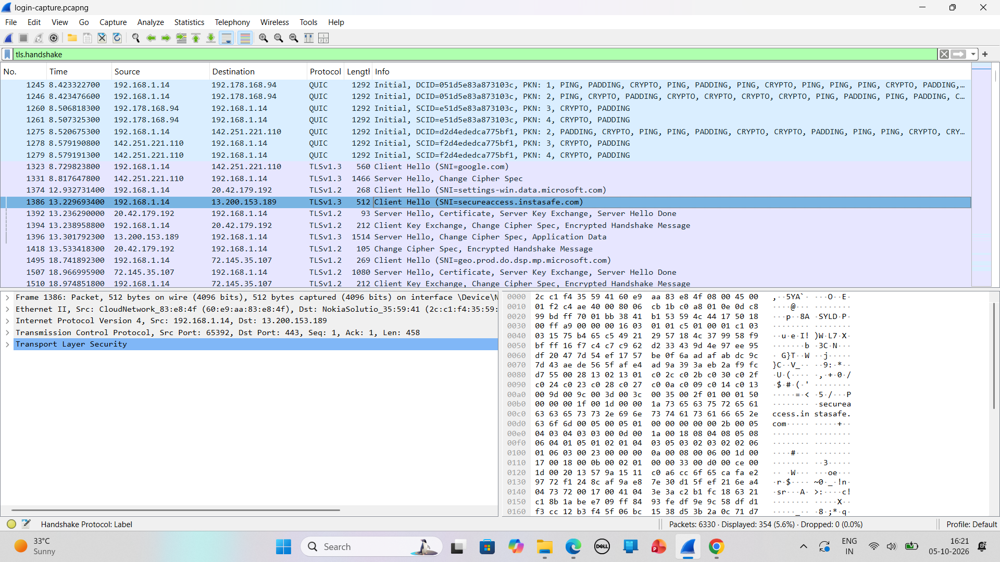
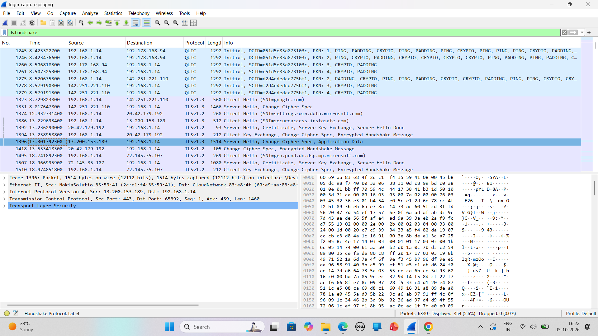
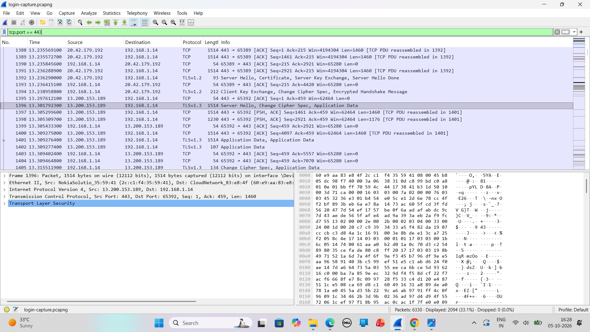
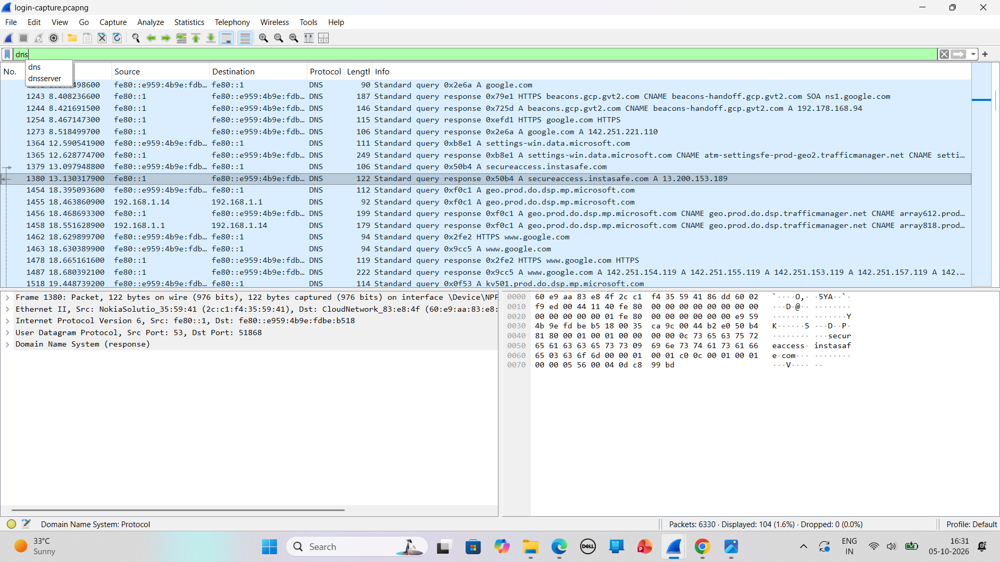
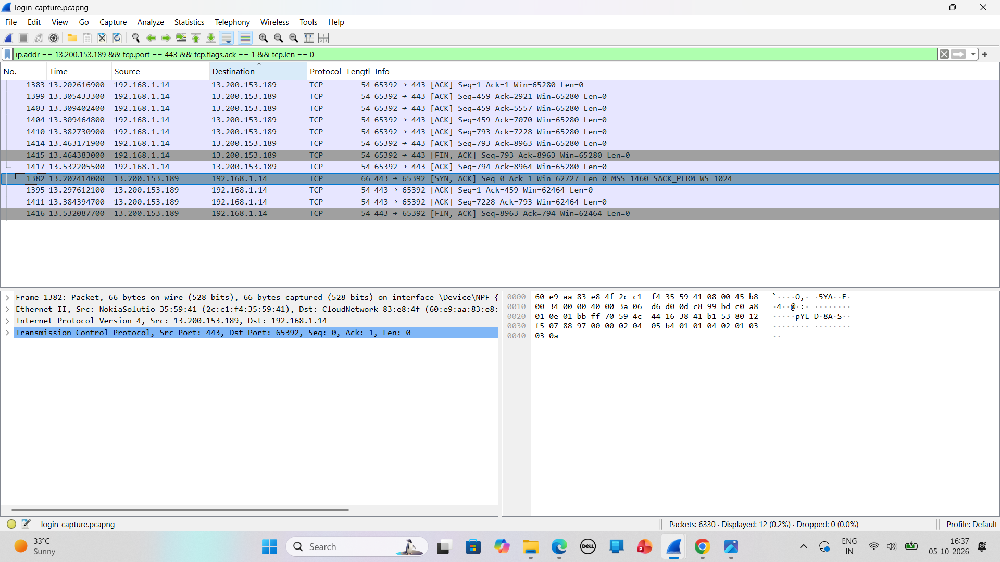
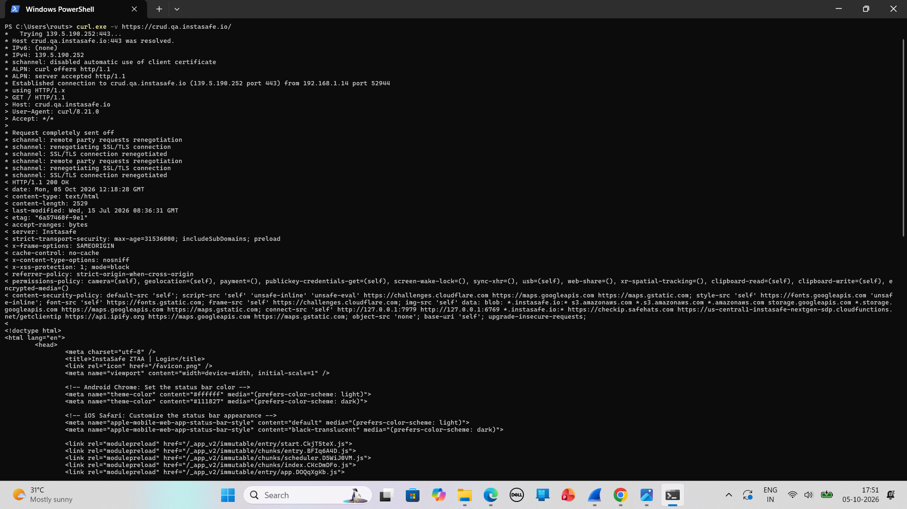

# Lab 0.1 – Network Fundamentals

## Wireshark Login Capture

A Wireshark packet capture was analyzed to understand the network communication during access to the InstaSafe application.

### TCP Connection

The TCP three-way handshake was observed on port 443:

1. TCP SYN – Client initiates the connection.
2. TCP SYN-ACK – Server responds to the connection request.
3. TCP ACK – Client acknowledges and establishes the TCP connection.

### TLS Communication

The capture shows encrypted HTTPS communication using TLS 1.3.

- TLS Client Hello – Client initiates the secure TLS connection to `secureaccess.instasafe.com`.
- TLS Server Hello – Server responds and continues the TLS handshake.
- TLS Application Data – Encrypted application data is exchanged.

The communication uses HTTPS over TCP port 443.

## Curl Output

A verbose HTTPS request was performed using:

```text
curl.exe -v https://crud.qa.instasafe.io/


## Evidence Screenshots

### TLS Client Hello


### TLS Server Hello


### HTTPS TLS Communication


### DNS Query and Response


### TCP Three-Way Handshake


### Curl Output

